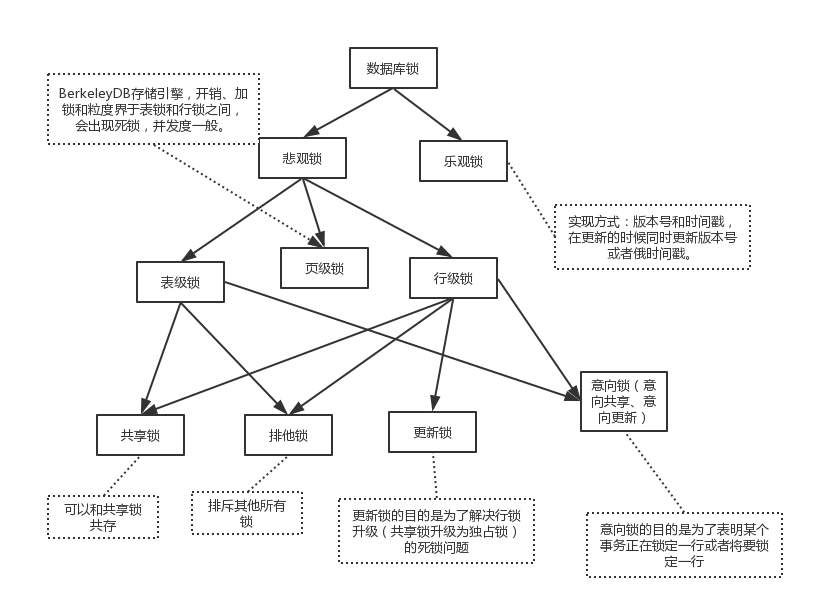

1. 什么是存储过程

存储过程（PROCEDURE）是一组完成某些特定功能的sql语句，有些类似于编程语言的函数。

详见[存储过程](../数据库知识体系/关系型数据库/Mysql/index.md)

它的好处在于:

* 封装了Sql语句，简化了使用过程
* 可以多次反复调用
* 预编译效率更高
* 可以传递参数，灵活多变
* 可以防止Sql注入攻击

2. 什么是索引

索引（index）是一种用于加快数据检索速度的结构。类似于书的目录。

如果没有索引，数据库需要遍历整个表来查找数据，时间为O(n)。

如果有索引，可以减少查找的速度，时间为O(logn)。

数据库的主键默认有索引。

也可以给列设置索引。

索引的缺点是会增加数据库大小，并且写入速度（插入，更新，删除）会变慢。

所以一般只会在经常需要查询，联结的列上设置索引。

不同的数据库不同的搜索引擎对索引会有不同的实现。

[https://blog.csdn.net/waeceo/article/details/78702584](https://blog.csdn.net/waeceo/article/details/78702584)

3. 什么是事务

https://www.cnblogs.com/takumicx/p/9998844.html

数据库事务是构成单一逻辑工作单元的操作集合

数据库事务具有ACID的特性，可以解决：

* 某些操作失败后应该如何处理
* 多个操作同时进行应该如何处理

4. 乐观锁和悲观锁

* 乐观并发控制:对于并发执行可能冲突的操作,假定其不会真的冲突,允许并发执行,直到真正发生冲突时才去解决冲突,比如让事务回滚。
* 悲观并发控制:对于并发执行可能冲突的操作,假定其必定发生冲突,通过让事务等待(锁)或者中止(时间戳排序)的方式使并行的操作串行执行。

7. 超键、候选键、主键、外键分别是什么

超键：在关系中能唯一标识元组的属性集称为关系模式的超键。一个属性可以为作为一个超键，多个属性组合在一起也可以作为一个超键。
候选键：是一个去除任何一个属性就不能唯一识别一行记录的超键
主键：指的是一个列或多列的组合，其值能唯一地标识表中的每一行，通过它可强制表的实体完整性。
外键：如果公共关键字在一个关系中是主关键字，那么这个公共关键字被称为另一个关系的外键。

8. 什么是视图？以及视图的使用场景有哪些

视图是指计算机数据库中的视图，是一个虚拟表，其内容由查询定义。

详见[视图](../数据库知识体系/关系型数据库/Mysql/index.md)

9. 说一说三个范式

三范式被用来在设计数据库表的时候提供一种标准建议。主要目的是分离依赖，将数据库表维护的尽可能小。

第一范式（1NF）：数据库表中的字段都是单一属性的，不可再分。

是否可以再分会取决于具体的使用场景，比如地址字段"江苏省常州市钟楼区"，如果你需要获取城市的信息而不仅仅是一个地址，你需要将这个字段再分成省，市，区这三个字段。这样的好处是你无需再在地址字段上进行计算，大大简化了复杂度，同时因为不需要计算提高了效率。最后因为拆分，可以比较好的应对未来需求变动，比如说要获取区的信息，会更加灵活。

第二范式（2NF）：数据库表中不存在非关键字段对任一候选关键字段的部分函数依赖（部分函数依赖指的是存在组合关键字中的某些字段决定非关键字段的情况），也即所有非关键字段都完全依赖于任意一组候选关键字。

比如说一张表有三个字段，商品id，商品名，类型，备注。主键为（商品id，类型）

| id | product_name | type | notes
| - | - | - | - | - |
| 1 | 白色瓷碗 | 瓷碗 | 易碎品 |
| 2 | 青花瓷碗 | 瓷碗 | 易碎品 |
| 3 | 雕花瓷碗	| 瓷碗 | 易碎品 |
| 4 | 普通三合板 | 三合板 | 易燃物品，注意防火 |

此时可以看到。备注只依赖于商品类型，这是主键的部分。

所以按照第二范式，我们应该将表拆分。

| id | product_name | type |
| - | - | - | - |
| 1 | 白色瓷碗 | 瓷碗 |
| 2 | 青花瓷碗 | 瓷碗 |
| 3 | 雕花瓷碗	| 瓷碗 |
| 4 | 普通三合板 | 三合板 |

将备注和商品类型放在另一张表。

这样的话，能够使表的大小尽可能的小。依赖也能尽可能的分离。

第三范式（3NF）：在第二范式的基础上，数据表中如果不存在非关键字段对任一候选关键字段的传递函数依赖则符合第三范式。

每个字段都必须与主键有直接关系，不是间接关系。

比如Student表（学号，姓名，年龄，性别，所在院校，院校地址，院校电话。

这样一个表结构，就存在上述关系。 学号 -> 所在院校 -> (院校地址，院校电话)。

这样的表结构，我们应该拆开来，如下：

（学号，姓名，年龄，性别，所在院校）--（所在院校，院校地址，院校电话）

10. 数据库事务的特性

必须要具有这四种特性，否则在事务过程（Transaction processing）当中无法保证数据的正确性，交易过程极可能达不到交易方的要求。

ACID.

A， 原子性（Atomicity）。整个事务中的所有操作，要么全部完成，要么全部不完成，不可能停滞在中间某个环节。事务在执行过程中发生错误，会被回滚（Rollback）到事务开始前的状态，就像这个事务从来没有执行过一样。

C， 一致性（Consistency）。一个事务可以封装状态改变（除非它是一个只读的）。事务必须始终保持系统处于一致的状态，不管在任何给定的时间并发事务有多少。

I，隔离性（isolation）， 隔离状态执行事务，使它们好像是系统在给定时间内执行的唯一操作。

D，持久性（Durability），在事务完成以后，该事务对数据库所作的更改便持久的保存在数据库之中，并不会被回滚。

以转账为例，

顾客向商家付款100元，此时的数据库事务操作为顾客的账户扣除100元，商家的账户加上100元。假设用户扣除成功，但是这时候某些地方出了问题导致商家无法收到顾客转账，这时这个事务就只有部分成功，按照`原子性`就会回退，顾客的100元会被回滚到顾客的账户中。

假设这个时候同时有5个客户给商家付款，此时会产生5个事务，分别为5个客户给商家付款。假设没人都会付给商家100元，如果都成功，商家最终会收到500元。这是`一致性`。

5个顾客同时可以给商家转账，相互之间不会受到影响，这是`隔离性`。

转账的记录最终会被数据库记录下来，这是`持久性`。

原子性使数据库的状态维持在一个比较可控的状态，如果回滚我们只需要再进行一次同样的操作就可以达到目的。如果部分成功，会导致难以判断需要进行哪些步骤才能恢复或者继续下去，并且部分成功也会导致不一致。

一致性避免了并发的多个事务同时对某一数据的修改破坏了数据的正确性。

隔离性使事务串行化执行，使事务修改数据变得简单。

持久性会保存状态，成功的则不会回滚。

11. 注入攻击

通过把SQL命令插入到Web表单提交或输入域名或页面请求的查询字符串，最终达到欺骗服务器执行恶意的SQL命令。

一些开发者不会将用户的输入进行过滤而是直接转发给数据库，导致了参数可以是合法的sql语句，数据库会执行这些sql语句，从而被攻击者获得或破坏数据库的数据。

举例：

一个用户需要填写用户名和密码，该用户填写了' or 1=1 --，然后随便输入一个密码，结果成功登陆了

该系统背后sql语句为select * from AUTH_USER t where t.LOG_IN_NAME='' or 1=1 --' and  t.PASSWORD='test'

因为1 = 1所以成功获得用户权限

解决方法：

* 对用户输入进行过滤
* 不要使用动态SQL，进行参数化查询
* 不要将敏感数据存储在数据库（密码明文）
* 限制数据库权限和特权
* 避免直接向用户显示数据库错误
* 对访问数据库的Web应用程序使用Web应用程序防火墙
* 定期测试与数据库交互的Web应用程序
* 将数据库更新为最新的可用修补程序

12. 索引的优化

DBCC SHOWCONTIG

https://blog.csdn.net/zhang_xiaomeng/article/details/78218829

13. 事务的并发问题

* 脏写：事务回滚了其他事务对数据项的已提交修改,比如下面这种情况
* 丢失更新：事务覆盖了其他事务对数据的已提交修改,导致这些修改好像丢失了一样
* 脏读：事务A读取了事务B更新的数据，然后B回滚操作，那么A读取到的数据是脏数据
* 不可重复读：事务 A 多次读取同一数据，事务 B 在事务A多次读取的过程中，对数据作了更新并提交，导致事务A多次读取同一数据时，结果因此本事务先后两次读到的数据结果会不一致。
* 幻读：幻读解决了不重复读，保证了同一个事务里，查询的结果都是事务开始时的状态（一致性）。

14. 事务的隔离级别

* 读未提交 read-uncommitted： 另一个事务修改了数据，但尚未提交，而本事务中的SELECT会读到这些未被提交的数据脏读
* 不可重复读(读已提交) read-committed： 事务 A 多次读取同一数据，事务 B 在事务A多次读取的过程中，对数据作了更新并提交，导致事务A多次读取同一数据时，结果因此本事务先后两次读到的数据结果会不一致
* 可重复读 repeatable-read： 在同一个事务里，SELECT的结果是事务开始时时间点的状态，因此，同样的SELECT操作读到的结果会是一致的。但是，会有幻读现象
* 串行化 serializable：最高的隔离级别，在这个隔离级别下，不会产生任何异常。并发的事务，就像事务是在一个个按照顺序执行一样

| 隔离级别 | 脏写 | 脏读 | 不可重复读 | 幻读 | 丢失更新 |
| - | - | - | - | - |
| 读未提交 | 1 | 0 | 0 | 0 | 0 | 
| 读已提交 | 1 | 1 | 0 | 0 | 0 |
| 可重复读 | 1 | 1 | 1 | 0 | 1 |
| 串行化 | 1 | 1 | 1 | 1 | 1 |

MySQL默认的事务隔离级别为repeatable-read

事务隔离级别：未提交读时，写数据只会锁住相应的行。
事务隔离级别为：可重复读时，写数据会锁住整张表。
事务隔离级别为：串行化时，读写数据都会锁住整张表。

15. 锁

https://www.cnblogs.com/yebingluo/p/10143852.html

16. MySQL常见的三种存储引擎（InnoDB、MyISAM、MEMORY）的区别？

https://blog.csdn.net/qq_24264221/article/details/80918375

17. 什么是聚簇索引和非聚簇索引

聚簇索引的数据和索引存放在一起，非聚簇索引相反。

Mysqk中innodb是聚簇索引，MyISAM是非聚簇

18. 并发控制方法

* 基于锁

共享锁：所有事务都可以对某个数据加共享锁，但不能加排他锁，只读
排他锁：只有一个事务可以获得数据的排他锁，可写

流程：
1. 事务申请锁
2. 锁管理器决定是否给锁
3. 锁被授予事务可以继续进行否则会等待

缺点：
1. 死锁
2. 饥饿

* 基于时间戳

每一个数据项Q有两个时间戳相关的字段:
W-timestamp(Q):成功执行write(Q)的所有事务的最大时间戳
R-timestamp(Q):成功执行read(Q)的所有事务的最大时间戳

时间戳排序规则如下:

假设事务T发出read(Q),T的时间戳为TS
a.若TS(T)<W-timestamp(Q),则T需要读入的Q已被覆盖。此
read操作将被拒绝,T回滚。
b.若TS(T)>=W-timestamp(Q),则执行read操作,同时把
R-timestamp(Q)设置为TS(T)与R-timestamp(Q)中的最大值

假设事务T发出write(Q)
a.若TS(T)<R-timestamp(Q),write操作被拒绝,T回滚。
b.若TS(T)<W-timestamp(Q),则write操作被拒绝,T回滚。
c.其他情况:系统执行write操作,将W-timestamp(Q)设置
为TS(T)

* 有效性检查

基于有效性检查的事务执行过程会被分为三个阶段:

读阶段:数据项被读入并保存在事务的局部变量中。所有write操作都是对局部变量进行,并不对数据库进行真正的更新。

有效性检查阶段:对事务进行有效性检查,判断是否可以执行write操作而不违反可串行性。如果失败,则回滚该事务。

写阶段:事务已通过有效性检查,则将临时变量中的结果更新到数据库中。

* 基于快照隔离

据库为每个数据项维护多个版本(快照),每个事务只对属于自己的私有快照进行更新,在事务真正提交前进行有效性检查,使得事务正常提交更新或者失败回滚。

由于快照隔离导致事务看不到其他事务对数据项的更新,为了避免出现丢失更新问题,可以采用以下两种方案避免：

先提交者获胜:对于执行该检查的事务T,判断是否有其他事务已经将更新写入数据库,是则T回滚否则T正常提交。

先更新者获胜:通过锁机制保证第一个获得锁的事务提交其更新,之后试图更新的事务中止。

事务间可能冲突的操作通过数据项的不同版本的快照相互隔离,到真正要写入数据库时才进行冲突检测。因而这也是一种乐观并发控制。

19. 故障与恢复

日志恢复

https://www.cnblogs.com/takumicx/p/9998844.html

20. 数据库引擎选择

https://blog.csdn.net/qq_24264221/article/details/80918375

21. Sql

https://zhuanlan.zhihu.com/p/26146000

22. left join， right join， inner join区别?

left join(左联接) 返回包括左表中的所有记录和右表中联结字段相等的记录

right join(右联接) 返回包括右表中的所有记录和左表中联结字段相等的记录

inner join(等值连接) 只返回两个表中联结字段相等的行

23. 存储引擎MyIsam和Innodb区别?

1、MyIsam类型不支持事务处理等高级处理，而Innodb类型支持 

事务处理是指原子性操作。例如，支持事务处理的Innodb表中，你发了一个帖子执行insert语句，来插入帖子内容，插入后要执行一个update语句来增加你的积分。假设一种特殊情况突然发生，insert成功了，update操作却没有被执行。也就是说你发了帖子却没有增加相应的积分。这就会造成用户不满。如果使用了事务处理，insert和update都放入到事务中去执行，这个时候，只有当insert和update两条语句都执行生成的时候才会将数据更新、写入到表中。如果其中任何一条语句失败，那么就会回滚为初始状态，不执行写入。这样就保证了insert和update肯定是一同执行的。

2、MyIsam表不支持外键。innodb支持外键

3、在执行数据写入的操作（insert,update,delete）的时候，MyIsam表会锁表，而innodb表会锁行。 

通俗的讲，就是你执行一个update语句，那么MyIsam表会将整个表都锁住，其他的insert和delete、update都会被拒之门外，等到这个update语句执行完成后才会被依次执行。而锁行，就是说，你执行update语句时，只会将这一条记录进行锁定，只有针对这条记录的其他写入、更新操作会被阻塞并等待这条update语句执行完毕后再执行，针对其他记录的写入操作不会有影响。但是innodb表的行锁也不是绝对的，如果在执行一个sql语句时，mysql不能确定要扫描的范围，innodb表同样会锁全表，例如update table set num =1 where name like “%aaa%”

24. 表锁、页锁、行锁的区别？

行级锁是mysql中锁定粒度最细的一种锁，表示只针对当前操作的行进行加锁。行级锁能大大减少数据库操作的冲突。其加锁粒度最小，但加锁的开销也最大。行级锁分为共享锁和排他锁。 
特点：开销大，加锁慢；会出现死锁；锁定粒度最小，发生锁冲突的概率最低，并发度也最高。

表级锁是mysql中锁定粒度最大的一种锁，表示对当前操作的整张表加锁，它实现简单，资源消耗较少，被大部分Mysql引擎支持。最常使用的myisam和innodb都支持表级锁定。表级锁定分为表共享读锁（共享锁）和表独占写锁（排他锁）。 
特点：开销小，加锁快；不会出现死锁；锁定粒度大，发出锁冲突的概率最高，并发度最低。

页级锁是mysql钟锁定粒度介于行级锁和表级锁中间的一种锁。表级锁速度快，但冲突多，行级冲突少，但速度慢。所以取了折中的页级，一次锁定相邻的一组记录。BDB支持页级表。 
特点：开销和加锁时间介于表锁和行锁之间；会出现死锁；锁定粒度介于表锁和行锁之间，并发度一般。

上述三种锁的特性可大致归纳如下： 

1） 表级锁：开销小，加锁快；不会出现死锁；锁定粒度大，发生锁冲突的概率最高，并发度最低。 

2） 行级锁：开销大，加锁慢；会出现死锁；锁定粒度最小，发生锁冲突的概率最低，并发度也最高。 

3） 页面锁：开销和加锁时间界于表锁和行锁之间；会出现死锁；锁定粒度界于表锁和行锁之间，并发度一般